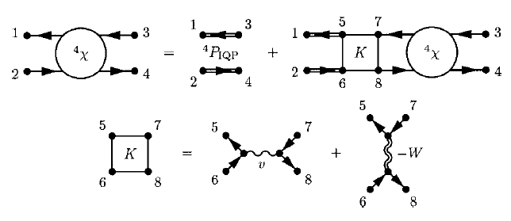

.. _bse:

.. default-role:: math

============================================
 Bethe Salpeter Equation (BSE) for excitons
============================================

Introduction
============
The BSE object calculates optical properties of extended systems including the electron-hole interaction (excitonic effects). 

The four point Bethe-Salpeter equation
======================================

Please refer to :ref:`df_theory` for the documentation on the density response function  `\chi`. 
Most of the derivations in this page follow reference  \ [#Review]_.

The following diagrams  \ [#Review]_ representing the four point Bethe-Salpeter equation: 

It can be written as: 

.. math::
   :label: chi_4point

   &\chi(\mathbf{r}_1, \mathbf{r}_2, \mathbf{r}_3, \mathbf{r}_4; \omega)  
    = \chi^{0}(\mathbf{r}_1, \mathbf{r}_2, \mathbf{r}_3, \mathbf{r}_4; \omega) \\ 
   & + \int d \mathbf{r}_5 d \mathbf{r}_6 d \mathbf{r}_7 d \mathbf{r}_8
	\chi^{0}(\mathbf{r}_1, \mathbf{r}_2, \mathbf{r}_5, \mathbf{r}_6; \omega)
        K( \mathbf{r}_5, \mathbf{r}_6, \mathbf{r}_7, \mathbf{r}_8; \omega)
          \chi(\mathbf{r}_7, \mathbf{r}_8, \mathbf{r}_3, \mathbf{r}_4; \omega)

where 

.. math::

   K = V - W
   = \frac{1}{| \mathbf{r}_5 -  \mathbf{r}_7|} 
     \delta_{ \mathbf{r}_5, \mathbf{r}_6}  \delta_{ \mathbf{r}_7, \mathbf{r}_8}
     -  \frac{\epsilon^{-1}( \mathbf{r}_5,  \mathbf{r}_6; \omega )}
      {| \mathbf{r}_5 -  \mathbf{r}_6|} 
     \delta_{ \mathbf{r}_5, \mathbf{r}_7}  \delta_{ \mathbf{r}_6, \mathbf{r}_8}
   
The density response function `\chi`, defined as  `\chi(\mathrm{r}, \mathrm{r}^{\prime}) = \delta n(\mathrm{r}) / \delta V_{ext}(\mathrm{r}^{\prime})`, has a form of 

.. math::
   :label: chi_2point

   \chi(\mathbf{r}_1, \mathbf{r}_2, \mathbf{r}_3, \mathbf{r}_4; \omega)
   = \chi(\mathbf{r}_1, \mathbf{r}_3; \omega)  \delta_{ \mathbf{r}_1, \mathbf{r}_2}
      \delta_{ \mathbf{r}_3, \mathbf{r}_4}

The above equation also applies for the non interacting density response function  `\chi^0`. As a result, the four point Bethe-Salpeter equation :eq:`chi_4point`  can be reduced to:

.. math::
   :label: chi_reduced

   \chi(\mathbf{r}, \mathbf{r}^{\prime}; \omega)
   &= \chi^0(\mathbf{r}, \mathbf{r}^{\prime}; \omega)
     + \int d \mathbf{r}_5 d \mathbf{r}_7 
      \chi^0(\mathbf{r}, \mathbf{r}_5; \omega)
      \frac{1}{| \mathbf{r}_5 -  \mathbf{r}_7|}  
       \chi(\mathbf{r}_7, \mathbf{r}^{\prime}; \omega) \\
     &+ \int d \mathbf{r}_5 d \mathbf{r}_6 
      \chi^0(\mathbf{r}, \mathbf{r}_5,  \mathbf{r}_6; \omega)
        \frac{\epsilon^{-1}( \mathbf{r}_5,  \mathbf{r}_6; \omega )}
      {| \mathbf{r}_5 -  \mathbf{r}_6|} 
      \chi(\mathbf{r}_5, \mathbf{r}_6, \mathbf{r}^{\prime}; \omega)      

Transform using electron-hole pair basis
========================================
Since for each excitation, only a limited number of electron-hole pairs will contribute , the above equation can be effectively transformed to electron-hole pair space. Supposed that the eigenfunctions `\psi_{n}` of the effective Kohn-Sham hamiltonian form an orthonormal and complete basis set, any four point function  `S` can then be transformed as 

.. math::
   :label: S

   S(\mathbf{r}_1, \mathbf{r}_2, \mathbf{r}_3, \mathbf{r}_4; \omega)
   = \sum_{n_1 n_2 n_3 n_4} \psi^{\ast}_{n_{1}}(\mathbf{r}_1)
    \psi_{n_{2}}(\mathbf{r}_2)  \psi_{n_{3}}(\mathbf{r}_3) 
    \psi^{\ast}_{n_{4}}(\mathbf{r}_4) 
    S_{\begin{array}{l} n_1 n_2 \\ n_3 n_4  \end{array}} (\omega)

The non interacting density response function  `\chi^0`

.. math::
   :label: chi_0
   
    \chi^0(\mathbf{r}_1, \mathbf{r}_2, \mathbf{r}_3, \mathbf{r}_4; \omega)
    = \sum_{n n^{\prime}} \frac{f_n - f_{n^{\prime}}}{\epsilon_n - \epsilon_{n^{\prime}}-\omega} \psi^{\ast}_n(\mathbf{r}_1)
    \psi_{n^{\prime}}(\mathbf{r}_2)  \psi_n(\mathbf{r}_3) 
    \psi^{\ast}_{n^{\prime}}(\mathbf{r}_4) 

is then diagonal in the electron-hole basis with 

.. math::
   :label: chi_0_eh

    \chi^0_{\begin{array}{l} n_1 n_2 \\ n_3 n_4  \end{array}} (\omega)
    =   \frac{f_{n_2} - f_{n_1}}{\epsilon_{n_2} - \epsilon_{n_1}-\omega} \delta_{n_1, n_3} \delta_{n_2, n_4} 

Substitute Eq. :eq:`S` and :eq:`chi_0` into Eq. :eq:`chi_reduced` and by using Eq. :eq:`chi_2point` ,the four point Bethe-Salpeter equation in electron-hole pair space becomes

.. math::
   :label: chi_eh

    \chi_{\begin{array}{l} n_1 n_2 \\ n_3 n_4  \end{array}} (\omega)
    = \chi^0_{n_1 n_2} (\omega) \left[ \delta_{n_1 n_3} \delta_{n_2 n_4} + \sum_{n_5 n_6} 
     K_{\begin{array}{l} n_1 n_2 \\ n_5 n_6  \end{array}} (\omega)
     \chi_{\begin{array}{l} n_5 n_6 \\ n_3 n_4  \end{array}} (\omega) \right] 

with  `K = V - W` and 

.. math::
   :label: V_2p

    V_{\begin{array}{l} n_1 n_2 \\ n_5 n_6  \end{array}} 
    = \int d \mathbf{r} d \mathbf{r}^{\prime}
    \psi_{n_1}(\mathbf{r}) \psi_{n_2}^{\ast}(\mathbf{r}) \frac{1}{|  \mathbf{r}-\mathbf{r}^{\prime} |}
     \psi^{\ast}_{n_5}(\mathbf{r}^{\prime}) \psi_{n_6}(\mathbf{r}^{\prime}) 

.. math::
   :label: W_2p

    W_{\begin{array}{l} n_1 n_2 \\ n_5 n_6  \end{array}} (\omega)
    = \int d \mathbf{r} d \mathbf{r}^{\prime}
    \psi_{n_1}(\mathbf{r}) \psi_{n_2}^{\ast}(\mathbf{r}^{\prime}) \frac{\epsilon^{-1}( \mathbf{r},  \mathbf{r}^{\prime}; \omega )}{|  \mathbf{r}-\mathbf{r}^{\prime} |}
     \psi^{\ast}_{n_5}(\mathbf{r}) \psi_{n_6}(\mathbf{r}^{\prime})

Bethe-Salpeter equation as an effective two-particle Hamiltonian
================================================================

In order to solve Eq. :eq:`chi_eh`, one has to invert a matrix for each frequency. 
This problem can be reformulated as an effective eigenvalue problem. Rewrite Eq. :eq:`chi_eh`
as 

.. math::

   \sum_{n_5 n_6} \left[ \delta_{n_1 n_5} \delta_{n_2 n_6}  - 
   \chi^0_{n_1 n_2}(\omega) K_{\begin{array}{l} n_1 n_2 \\ n_5 n_6  \end{array}} (\omega)
    \right]
     \chi_{\begin{array}{l} n_5 n_6 \\ n_3 n_4  \end{array}} (\omega)
   =  \chi^0_{n_1 n_2}(\omega)

Insert Eq. :eq:`chi_0_eh` into the above equation, one gets

.. math::
   :label: chi_rewrite

   \sum_{n_5 n_6} \left[  (\epsilon_{n_2} - \epsilon_{n_1}-\omega)
    \delta_{n_1 n_5} \delta_{n_2 n_6}
   - (f_{n_2} - f_{n_1}) K_{\begin{array}{l} n_1 n_2 \\ n_5 n_6  \end{array}} (\omega)
   \right]
   \chi_{\begin{array}{l} n_5 n_6 \\ n_3 n_4  \end{array}} (\omega)
   = f_{n_2} - f_{n_1}    

By using a static interaction kernel `K(\omega=0)`, an effective frequency-indendepnt 
two particle Hamiltonian is defined as: 

.. math::
   :label: H_2p

   \mathcal{H}_{\begin{array}{l} n_1 n_2 \\ n_5 n_6  \end{array}} 
   \equiv  (\epsilon_{n_2} - \epsilon_{n_1}) \delta_{n_1 n_5} \delta_{n_2 n_6}
   - (f_{n_2} - f_{n_1}) K_{\begin{array}{l} n_1 n_2 \\ n_5 n_6  \end{array}}

Inserting the above effective Hamiltonian into Eq. :eq:`chi_rewrite`, one can then write 

.. math::

   \chi_{\begin{array}{l} n_1 n_2 \\ n_3 n_4  \end{array}} = 
   \left[ \mathcal{H} - I \omega \right]^{-1}_{\begin{array}{l} n_1 n_2 \\ n_3 n_4  \end{array}}
   (f_{n_2} - f_{n_1})

where `I` is an identity matrix that has the same size as `\mathcal{H}`. 

The spectral representation of the inverse two-particle Hamiltonian is 

.. math::

   \left[ \mathcal{H} - I \omega \right]^{-1}_{\begin{array}{l} n_1 n_2 \\ n_3 n_4  \end{array}}
   = \sum_{\lambda \lambda^{\prime}} 
   \frac{A^{n_1 n_2}_{\lambda} A^{n_3 n_4}_{\lambda^{\prime}} N^{-1}_{\lambda \lambda^{\prime}}}{E_{\lambda} - \omega}

with the eigenvalues `E_{\lambda}` and eigenvectors `A_{\lambda}` given by 

.. math::

   \mathcal{H} A_{\lambda} = E_{\lambda} A_{\lambda} 

and the overlap matrix `N_{\lambda \lambda^{\prime} }` defined by

.. math::

    N_{\lambda \lambda^{\prime}} \equiv 
    \sum_{n_1 n_2} [A_{\lambda}^{n_1 n_2}]^{\ast} A_{\lambda^{\prime}}^{n_1 n_2}

If the Hamiltonian `\mathcal{H}` is Hermitian, the eigenvectors `A_{\lambda}` are then orthogonal and 

.. math::

	N_{\lambda \lambda^{\prime}} = \delta_{\lambda \lambda^{\prime}}

Explicit kpoint dependence
==========================

In this subsection, the kpoint dependence of the eigenstates is written explicitly. 

The effective two particle Hamiltonian in Eq. :eq:`H_2p` becomes

.. math::

   \mathcal{H}_{\begin{array}{l} n_1 n_2 \mathbf{k}_1 \\ n_5 n_6  \mathbf{k}_5 \end{array}} ( \mathbf{q})
   \equiv  (\epsilon_{n_2 \mathbf{k}_1 + \mathbf{q}} - \epsilon_{n_1  \mathbf{k}_1}) 
   \delta_{n_1 n_5}  \delta_{n_2 n_6} \delta_{\mathbf{k}_1 \mathbf{k}_5}
   - (f_{n_2 \mathbf{k}_1 + \mathbf{q}} - f_{n_1  \mathbf{k}_1}) 
    K_{\begin{array}{l} n_1 n_2  \mathbf{k}_1 \\ n_5 n_6  \mathbf{k}_5 \end{array}} ( \mathbf{q})

where `K=V-W` and according to Eq. :eq:`V_2p` and :eq:`W_2p`, 

.. math::
   :label: V_eh   

    V_{\begin{array}{l} n_1 n_2  \mathbf{k}_1 \\ n_5 n_6  \mathbf{k}_5 \end{array}} ( \mathbf{q})
    = \int d \mathbf{r} d \mathbf{r}^{\prime}
    \psi_{n_1  \mathbf{k}_1}(\mathbf{r}) \psi_{n_2  \mathbf{k}_1 + \mathbf{q}}^{\ast}(\mathbf{r}) \frac{1}{|  \mathbf{r}-\mathbf{r}^{\prime} |}
     \psi^{\ast}_{n_5  \mathbf{k}_5}(\mathbf{r}^{\prime}) \psi_{n_6  \mathbf{k}_5 + \mathbf{q}}(\mathbf{r}^{\prime})

.. math::
   :label: W_eh

    W_{\begin{array}{l} n_1 n_2  \mathbf{k}_1 \\ n_5 n_6 \mathbf{k}_5 \end{array}} (  \mathbf{q})
    = \int d \mathbf{r} d \mathbf{r}^{\prime}
    \psi_{n_1 \mathbf{k}_1}(\mathbf{r}) \psi_{n_2 \mathbf{k}_1 + \mathbf{q}}^{\ast}(\mathbf{r}^{\prime}) \frac{\epsilon^{-1}( \mathbf{r},  \mathbf{r}^{\prime}; \omega=0 )}{|  \mathbf{r}-\mathbf{r}^{\prime} |}
     \psi^{\ast}_{n_5 \mathbf{k}_5}(\mathbf{r}) \psi_{n_6 \mathbf{k}_5 + \mathbf{q}}(\mathbf{r}^{\prime}) 

Transform between electron-hole pair space and reciprocal space
===============================================================

The physical quantities such as macroscopic dielectric function (refer to :ref:`macroscopic_dielectric_function`) are related to the long wavelength limit `(\mathbf{G}=0, \mathbf{G}^{\prime}=0)` component of the response function `\chi_{\mathbf{G} \mathbf{G}^{\prime}}`. Its relation to the response function in electron-hole pair space `\chi_{\begin{array}{l} n_1 n_2 \\ n_3 n_4  \end{array}}` is written as 

.. math::

   \chi_{\mathbf{G} \mathbf{G}^{\prime}} (\mathbf{q}, \omega) 
   = \frac{1}{\Omega} \sum_{\begin{array}{l} n_1 n_2  \mathbf{k}_1  \\ n_3 n_4  \mathbf{k}_3 \end{array}}
   \chi_{\begin{array}{l} n_1 n_2 \mathbf{k}_1\\ 
         n_3  n_4 \mathbf{k}_3   \end{array}} (\omega)
   \ \  \rho_{\begin{array}{l} n_1 \mathbf{k}_1 \\ 
         n_2 \mathbf{k}_1 + \mathbf{q}  \end{array}} (\mathbf{G})
   \ \  \rho^{\ast}_{\begin{array}{l} n_3 \mathbf{k}_3 \\ 
         n_4 \mathbf{k}_3 + \mathbf{q}  \end{array}} (\mathbf{G}^{\prime})

where the charge density matrix `\rho (\mathbf{G})` is defined as:

.. math::

   \rho_{\begin{array}{l} n_1 \mathbf{k}_1 \\ 
         n_2 \mathbf{k}_1 + \mathbf{q}  \end{array}} (\mathbf{G})
   \equiv \langle \psi_{n_1 \mathbf{k}_1} | e^{-i(\mathbf{q}+\mathbf{G}) \cdot \mathbf{r} }
   | \psi_{n_2 \mathbf{k}_1 + \mathbf{q}} \rangle

Employing Fourier transform

.. math::

   \frac{1}{| \mathbf{r}-\mathbf{r}^{\prime} |}
   = \frac{1}{\Omega} \sum_{\mathbf{q} \mathbf{G}} 
     \frac{4\pi}{ | \mathbf{q} + \mathbf{G}|^2 }
     e^{i ( \mathbf{q} + \mathbf{G}) \cdot (  \mathbf{r} - \mathbf{r}^{\prime} )  }

.. math::

   \frac{\epsilon^{-1}(\mathbf{r},\mathbf{r}^{\prime}) }{| \mathbf{r}-\mathbf{r}^{\prime} |}
   = \frac{1}{\Omega} \sum_{\mathbf{q} \mathbf{G} \mathbf{G}^{\prime} } 
      e^{i ( \mathbf{q} + \mathbf{G}) \cdot   \mathbf{r} } 
     \frac{4\pi  \epsilon^{-1}_{\mathbf{G}  \mathbf{G}^{\prime}} (\mathbf{q}) }{ | \mathbf{q} + \mathbf{G}|^2 }
     e^{-i ( \mathbf{q} + \mathbf{G}^{\prime}) \cdot \mathbf{r}^{\prime}   }

where `\Omega` is the volume of the unit cell, 
`V` and `W` in Eq. :eq:`V_eh` and  :eq:`W_eh`  can then be written respectively as

.. math::

   V_{\begin{array}{l} n_1 n_2  \mathbf{k}_1 \\ n_5 n_6  \mathbf{k}_5 \end{array}} ( \mathbf{q})
    =\sum_{\mathbf{G}}
    \rho^{\ast}_{\begin{array}{l} n_1 \mathbf{k}_1 \\ 
         n_2 \mathbf{k}_1 + \mathbf{q}  \end{array}} (\mathbf{G})
    \ \frac{4\pi}{| \mathbf{q} + \mathbf{G}|^2}
    \ \rho_{\begin{array}{l} n_5 \mathbf{k}_5 \\ 
         n_6 \mathbf{k}_5 + \mathbf{q}  \end{array}} (\mathbf{G})

.. math::

   W_{\begin{array}{l} n_1 n_2  \mathbf{k}_1 \\ n_5 n_6 \mathbf{k}_5 \end{array}} (  \mathbf{q})
   = \sum_{\mathbf{G}  \mathbf{G}^{\prime}}
    \rho^{\ast}_{\begin{array}{l} n_1 \mathbf{k}_1 \\ 
         n_5 \mathbf{k}_5 \end{array}} (\mathbf{G})
    \ \frac{4\pi \epsilon^{-1}_{\mathbf{G}  \mathbf{G}^{\prime}} (\mathbf{q}; \omega=0) }{| \mathbf{q} + \mathbf{G}|^2}
    \ \rho_{\begin{array}{l} n_2 \mathbf{k}_1 + \mathbf{q} \\ 
         n_6 \mathbf{k}_5 + \mathbf{q}  \end{array}} (\mathbf{G}^{\prime})

Dielectric function and its relation to spectra
===============================================

.. [#Review] G. Onida, L. Reining and A. Rubio,
            Electronic excitations: density-functional versus many-body Green's-function approaches,
            *Rev. Mod. Phys.* **74**, 601 (2002)

