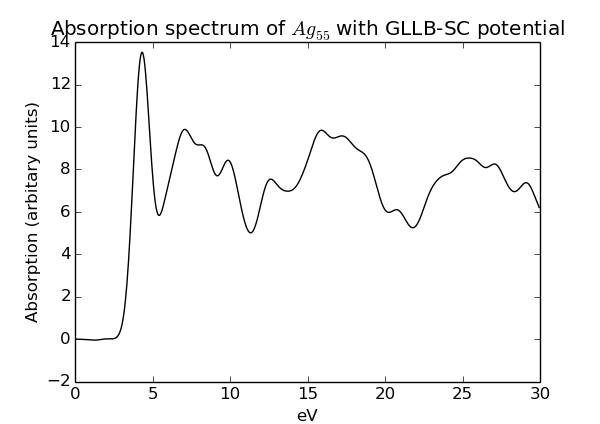
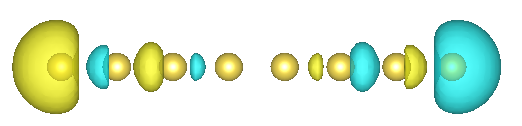

.. _lcaotddft:

=========================================
Time-propagation TDDFT with LCAO : Theory
=========================================

This page documents the use of time-propagation TDDFT in :ref:`LCAO
mode <lcao>`. The implementation is described in [#Kuisma2015]_.

Real time propagation of LCAO-functions
=======================================

In real time LCAO-TDDFT approach, the time-dependent wave functions are 
represented using localized basis sets as

.. math::

  \tilde{\Psi(\mathbf{r},t)} = \sum_{\mu} C_{\mu i}(t) \tilde{\phi}(\mathbf{r}-\mathbf{R}^\mu)}.

The TD-Kohn-Sham equation in PAW formalism can be written as

.. math::

  \left[ \widehat T^\dagger \left( -i \frac{{\rm d}}{{\rm d}t} + \hat H_{\rm KS}(t) \right) \widehat T \right]  \tilde{\Psi(\mathbf{r},t)} = 0.

Using these equations, following matrix equation can be derived for LCAO wave 
function coefficients

.. math::
  {\rm i}\mathbf{S} \frac{{\rm d}\mathbf{C}(t)}{{\rm d}t} = \mathbf{H}(t) \mathbf{C}(t).

In current implementation in GPAW, C, S and H are full matrices, which are 
parellelized using ScaLAPACK. Currently semi implicit Crank-Nicholson method 
(SICN) is used to propagate wave functions. For wave functions at time t, one 
propagates the system forward using H(t) and solving a linear equation

.. math::

  \left( \mathbf{S} + i H(t) dt / 2 \right) C'(t+dt) = \left( S - i H(t) dt / 2 \right) C(t)

Using the predicted wave functions at C'(t+dt), the Hamiltonian H'(t+dt) is 
calculated and the Hamiltonian at middle of the time step is estimated as

.. math::

   H(t+dt/2) = (H(t) + H'(t+dt)) / 2

With the improved Hamiltonian, have functions are again propagated from t to t+dt

  \left( \mathbf{S} + i H(t+dt/2) dt / 2 \right) C(t+dt) = \left( S - i H(t+dt/2) dt / 2 \right) C(t)

This procedure is repeated using time step of 5-40as and for 500-2000 times to 
obtain time evolution of electrons.

========================================
Time-propagation TDDFT with LCAO : Usage
========================================

Create LCAOTDDFT object like a GPAW calculator::

 >>> from gpaw.lcaotddft import LCAOTDDFT
 >>> td_calc = LCAOTDDFT(setups={'Na':'1'}, basis='1.dzp', xc='LDA', h=0.3, nbands=1,
                         convergence={'density':1e-7},
                         poissonsolver=PoissonSolver(eps=1e-20, remove_moment=1+3+5))

Important points are:

 * Use always compatible setups and basis sets.
 * Grid spacing is only used to calculate the Hamiltonian matrix and therefore larger grid than usual can be used.
 * Completely unoccupied bands should be left out of the calculation, since they are not needed.
 * Convergence of density should be few orders of magnitude more accurate than in ground state calculations.
 * Convergence of poisson solver should be at least 1e-14, but 1e-20 does not hurt (this is the quadratic error).
 * One should use multipole corrected poisson solver in any TDDFT run. See PoissonSolver documentation about flags.

Perform a regular ground state calculation, the get the ground state wave functions::

 >>> atoms.set_calculator(td_calc)
 >>> atoms.get_potential_energy()

If you wish to save here, write the wave functions also::

 >>> td_calc.write('Na2.gpw', mode='all')

The calculation proceeds as in grid mode. We kick the system to x-direction and propagate with 10as time steps for 500 steps::

 >>> td_calc.absorption_kick([1e-5, 0.0, 0.0])
 >>> td_calc.propagate(10, 500, out='Na2.dm')

The spectrum is obtained in same manner, as in grid propagation mode.

Simple run script
=================

.. literalinclude:: lcaotddft.py

General notes about basis sets
==============================

In time-propagation LCAO-TDDFT, the basis sets are in even more crucial role than 
in a ground state LCAO calculation. It is required, that basis set can represent 
both the occupied (electrons) and relevant unoccupied states (holes) adequately. 
Custom basis sets for the time propagation should be generated according to ones 
need, and then benchmarked.

**Irrespective of the basis sets you choose, ALWAYS, ALWAYS, benchmark LCAO 
results with respect to grid time-propagation code** on a largest system 
possible. For example, one can create a prototype system, which consists of 
similar atom species with similar roles than in the parent system, but small 
enough to calculate with grid propagation mode. Example will be given in advanced 
tutorial.

After these remarks, we describe two sets of basis sets that can be used as a 
starting point for choosing suitable basis set for your needs. Namely, 
:ref:`pvalence basis sets` and :ref:`coopt basis sets`.

.. _pvalence basis sets:

p-valence basis sets
--------------------

The so-called p-valence basis sets are constructed by replace the p-type 
polarization function of the default basis sets with bound unoccupied p-type 
orbital and its split-valence complement. Such basis sets correspond to the ones 
used in Ref. [#Kuisma2015]_. These basis sets significantly improve density of 
states of unoccupied states.

The p-valence basis sets can be easily obtained for appropriate elements by 
``gpaw-install-setups`` tool, see XXX. It is again reminded that these basis sets 
are not thoroughly tested and **it is essential to benchmark the performance of 
the basis sets for your application**.

.. _coopt basis sets:

Completeness-optimized basis sets
---------------------------------

A systematic approach for improving the basis sets can be obtained with the 
so-called completeness-optimization approach. This approach is used in Ref. 
[#Rossi2015]_ to generate basis set series for TDDFT calculations of copper, 
silver, and gold clusters.

For further details of the basis sets, as well as their construction and 
performance, see [#Rossi2015]_. For convenience, these basis sets can be easily 
obtained with ``gpaw-install-setups`` tool, see XXX. Finally, it is again 
emphasized that when using the basis sets, **it is essential to benchmark their 
suitability for your application**.

Parallelization
===============

LCAO-TDDFT is parallelized using ScaLAPACK. It runs without scalapack, but in this case only single core is used for linear alrebra.

 * ScaLAPACK can be enabled by specifying --sl_default=N,M,64 in command line.
 * Alternatively, use parallization={'sl_default':(N,M,64)}.
 * It is necessary that N*M equals to total number of cores and max(N,M)*64 < nbands. 64 can be changed to 16 if necessary.
 * Apart from parallelization of linear algrebra, normal domain and band parallelizations can be used. As in LCAO-mode usually, use band parallelization to reduce memory consumption.

PoissonSolver
=============

The ``PoissonSolver`` with default parameters uses zero boundary conditions on 
the cell boundaries. This becomes a problem in systems involving large dipole 
moment, for example (due to, e.g., plasmonic charge oscillation on a 
nanoparticle). The potential due to the dipole is long-ranged and, thus, the 
converged potential requires large vacuum sizes.

However, in LCAO approach large vacuum size is often unnecessary. Thus, to avoid 
using large vacuum sizes but get converged potential, one can use two approaches 
or their combination: 1) use multipole moment corrections or 2) solve Poisson 
equation on a extended grid. These two approaches are implemented in 
``ExtendedPoissonSolver``. Also regular PoissonSolver in GPAW has the option 
remove_moment.

In any nano-particle plasmonics calculation, it is necessary to use multipole 
correction. Without corrections more than 10Å of vacuum is required for converged 
results.

Multipole moment corrections
----------------------------

The boundary conditions can be improved by adding multipole moment corrections to 
the density so that the corresponding multipoles of the density vanish. The 
potential of these corrections is added to the obtained potential. For a 
description of the method, see [#Castro2003]_.

This can be accomplished by following solver::

  from gpaw.poisson_extended import ExtendedPoissonSolver
  poissonsolver = ExtendedPoissonSolver(eps=eps,
                                        moment_corrections=4)

This corrects the 4 first multipole moments, i.e., `s`, `p_x`, `p_y`, and `p_z` type multipoles. The range of
multipoles can be changed by changing ``moment_corrections`` parameter. For example, ``moment_correction=9`` includes in addition to the previous multipoles, also `d_{xx}`, `d_{xy}`,
`d_{yy}`, `d_{yz}`, and `d_{zz}` type multipoles.

This setting suffices usually for spherical-like metallic nanoparticles, but more 
complex geometries require inclusion of very high multipoles or, alternatively, a 
multicenter multipole approach. For this, consider the advanced syntax of the 
moment_corrections. The previous code snippet is equivalent to::

  from gpaw.poisson_extended import ExtendedPoissonSolver
  poissonsolver = ExtendedPoissonSolver(eps=eps,
                                        moment_corrections=[{'moms': range(4), 'center': None}])

Here ``moment_corrections`` is a list of dictionaries with following keywords: 
``moms`` specifies the considered multipole moments, e.g., ``range(4)`` equals to 
`s`, `p_x`, `p_y`, and `p_z` multipoles, and ``center`` specifies the center of 
the added corrections in atomic units (``None`` corresponds to the center of the 
cell).

As an example, consider metallic nanoparticle dimer where the nanoparticle 
centers are at ``(x1, y1, z1)`` Å and ``(x2, y2, z2)`` Å. In this case, the 
following settings for the ``ExtendedPoissonSolver`` may be tried out::

  import numpy as np
  from ase.units import Bohr
  from gpaw.poisson_extended import ExtendedPoissonSolver
  moms = range(4)
  center1 = np.array([x1, y1, z1]) / Bohr
  center2 = np.array([x2, y2, z2]) / Bohr
  poissonsolver = ExtendedPoissonSolver(eps=eps,
                                        moment_corrections=[{'moms': moms, 'center': center1},
					                    {'moms': moms, 'center': center2}])

When multiple centers are used, the multipole moments are calculated on 
non-overlapping regions of the calculation cell. Each point in space is 
associated to its closest center. See `Voronoi diagrams 
<http://en.wikipedia.org/wiki/Voronoi_diagram>`_ for analogous illustration of 
the partitioning of a plane.

Extended Poisson grid
---------------------

The multipole correction scheme is not always successful for complex system geometries.
For these cases, one can use a separate large grid just for solving the Hartree potential.
Such extended grid can be set up as follows::

  from gpaw.poisson_extended import ExtendedPoissonSolver
  poissonsolver = ExtendedPoissonSolver(eps=eps,
                                        extended={'gpts': (128, 128, 128),
					          'useprev': False})

This solves the Poisson equation on an extended grid. The size of the grid is 
given **in units of coarse grid**. Thus, in this case the fine extended grid used 
in evaluating the Hartree potential is of size (256, 256, 256). It is important 
to **use grid sizes that are divisible by high powers of 2 to accelerate the 
multigrid scheme** used in ``PoissonSolver``.

The ``useprev`` parameter describes whether the ``ExtendedPoissonSolver`` uses 
the previous solution as a initial potential for subsequent calls of the function 
``solver.solve()``. It is often reasonable to use ``useprev = True``, which 
mimics the behaviour of the usual ``PoissonSolver`` in most cases. In such cases, 
the value ``useprev = False`` would lead to significant performance decrease 
since the Hartree potential is always calculated from scratch.

.. note::

   When extended grid is in use, the implementation neglects the ``phi`` parameter given to the
   ``solver.solve()`` due to its incompatibility with the extended grid. 

Timing
======

TODO: add ``ParallelTimer`` example

Advanced tutorial - Plasmon resonance of silver cluster
=======================================================

One should think what type of transitions is there of interest, and make sure 
that the basis set can represent such Kohn-Sham electron and hole wave functions. 
The first transitions in silver cluster will be `5s \rightarrow 5p` like. We 
require 5p orbitals in the basis set, and thus, we must generate a custom basis 
set.

Here is how to generate a double-zeta basis set with 5p orbital in valence for 
Silver for GLLB-SC potential. We will use GPAW 0.8 setup definition, since semi-core p states are not relevant here.

.. literalinclude:: lcaotddft_basis.py

We calculate the icosahedral Ag55 cluster: :download:`ag55.xyz`

This code uses ScaLAPACK parallelization with 64 cores.

.. literalinclude:: lcaotddft_ag55.py

Code runs for approximately two wall hours. The resulting spectrum shows already emerging plasmonic excitation around 4 eV.
For more details, see [#Kuisma2015]_.

Induced density
===============

Plotting the induced density is especially interesting in case of plasmon resonances. As an example, we calculate a dummy Na8 wire and write density to a file on every iteration.
There is certain advantages in writing the density on every iteration instead of using the predefined frequencies and on-fly Fourier transformation: only one TDDFT run is required as any frequency can be analysed as a post processing operation.
Hard disk requirements are large, but tolerable (1-100GB) in usual cases.

.. literalinclude:: lcaotddft_induced.py

Files with extensions .sG and .asp are created, where .sG contains the density in coarse grid and .asp contains the atomic density matrix. With these, it is possible to reconstruct the full density.
This can now be fourier transformed at desired frequency. Here, we look from the produced spectrum file that plasmonic peak, and perform Fourier transform at that frequency.

.. literalinclude:: lcaotddft_analyse.py

Two cube files are created, one for sin (imag) and cos (real) transform at the frequency. Usually, one is interested in the absorbing part i.e. imaginary part. Below is visualized the plasmon resonance
in Na8 wire.

Advanced tutorial - large organic molecule
==========================================

General notes
-------------

On large organic molecules, on large conjugated systems, there will`\pi 
\rightarrow \pi^*`, `\sigma \rightarrow \sigma^*`. These states consists of only 
the valence orbitals of carbon, and they are likely by quite similar few eV's 
below and above the fermi lavel. These is thus a reason to believe that these 
states are well described with hydrogen 1s and carbon 2s and 2p valence orbitals 
around the fermi level.

Here, we will calculate a small and a large organic molecule with lcao-tddft.

**TODO**

Kohn-Sham decomposition of the transition density matrix
========================================================

Soon it will be possible to analyse the origin of the transitions the same way as is commonly done in Casida-based codes.
The LCAO basis will be transformed to electron-hole basis of the Kohn-Sham system.

References
==========

.. [#Kuisma2015]
   M. Kuisma, A. Sakko, T. P. Rossi, A. H. Larsen, J. Enkovaara, L. Lehtovaara, and T. T. Rantala, 
   Localized surface plasmon resonance in silver nanoparticles: Atomistic first-principles time-dependent
   density functional theory calculations,
   *Phys. Rev. B* **69**, 245419 (2004).
   `doi:10.1103/PhysRevB.91.115431 <http://dx.doi.org/10.1103/PhysRevB.91.115431>`_

.. [#Rossi2015]
   T. P. Rossi, S. Lehtola, A. Sakko, M. J. Puska, and R. M. Nieminen,
   Nanoplasmonics simulations at the basis set limit through completeness-optimized, local numerical basis sets,
   *J. Chem. Phys.* **142**, 094114 (2015).
   `doi:10.1063/1.4913739 <http://dx.doi.org/10.1063/1.4913739>`_

.. [#Castro2003]
   A. Castro, A. Rubio, and M. J. Stott,
   Solution of Poisson's equation for finite systems using plane-wave methods,
   *Can. J. Phys.* **81**, 1151 (2003).
   `doi:10.1139/p03-078 <http://dx.doi.org/10.1139/p03-078>`_

