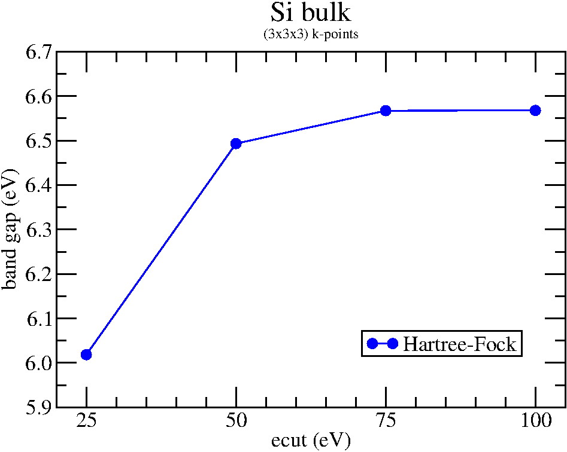
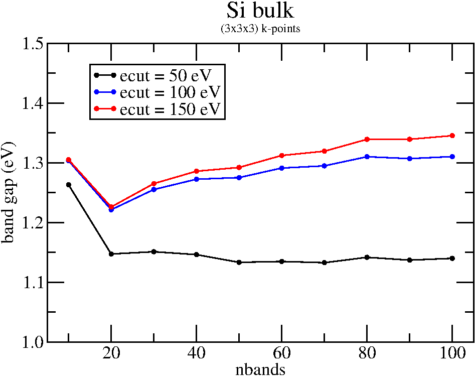
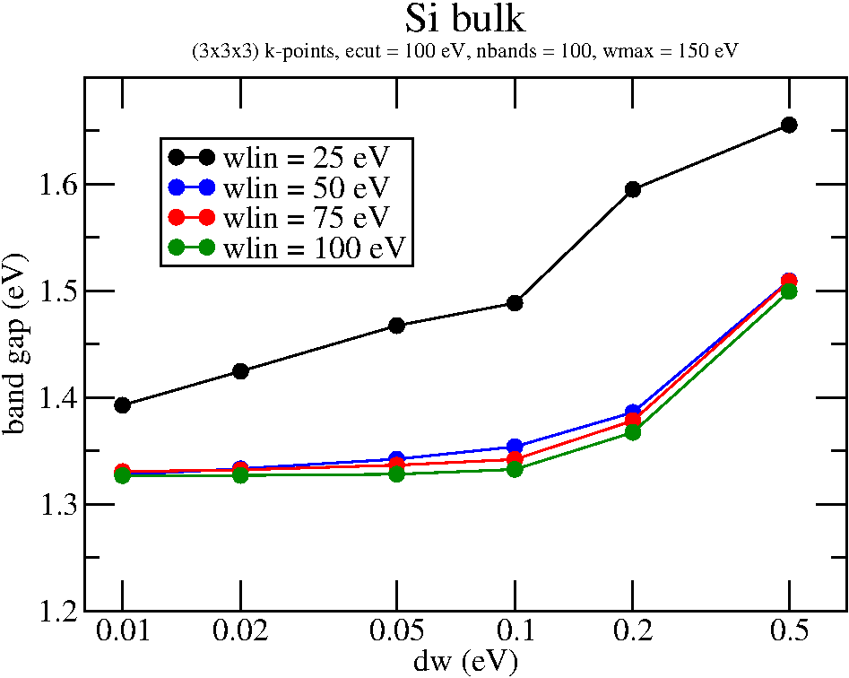

.. _gw_tutorial:

=========================================================
Quasi-particle spectrum in the GW approximation: tutorial
=========================================================

For a brief introduction to the GW theory and the details of its implementation in GPAW, see :ref:`gw_theory`.

**For GW calculations, the latest development release is required.**

This tutorial and the documentation will frequently be updated.

Quasi-particle spectrum of bulk silicon
=======================================

groundstate calculation
-----------------------

First, we need to do a regular groundstate calculation using the LDA exchange-correlation functional. In order to keep the computational efforts reasonable, we choose (3x3x3) k-points, although this might certainly not be sufficient for a realistic system. For the GW calculation, we will need a large number of unoccupied bands. Here, we also choose a rather small value, namely 100.

.. literalinclude:: Si_groundstate.py

It takes about half an hour on a single CPU. The last line in the script creates a .gpw file which contains all the informations of the system, including the wavefunctions.

exact exchange contributions
----------------------------

*This step is not required, as it can automatically be done within the GW calculation. However, it is recommended, since it provides a quick and easy way for checking the convergence for the exact exchange seperately. Also, when running in parallel, it can be much more efficient.*

Next, we calculate the contributions from exact exchange and prepare a file, that contains all the matrix elements in the right format that we will need for the GW calculation. Usually, only the part of the spectrum around the Fermi level and along certain directions in k-space are of interest. Therefore, we have to pick the band and k-point indices for which we want the GW energies to be evaluated.

The following script shows, how the correct matrix elements can be extracted from the groundstate calculator and the ``vxc`` and ``exx`` objects:

.. literalinclude:: Si_exx.py

For details on how the exact exchange contributions are calculated and the role of the ``alpha`` parameter, see http://wiki.fysik.dtu.dk/gpaw/devel/planewaves.html

The last lines of the output should look like this:

.. literalinclude:: Si_exx.out

Columns denote the bands and rows the k-points. We can read off an indirect band gap of 10.98 - 4.96 = 6.02 eV. As expected, the gap opens dramatically compared to the LDA result (0.57 eV), but is way too large.

Now, repeat the calculation for different values of ``ecut`` and see how the band gap converges. Change the name of the pickle output file accordingly.

*For planewave calculations, use*

.. literalinclude:: pw.txt

*instead. In this case,* ``ecut`` *cannot be varied and the value from the groundstate calculation is chosen.*
       
quasi-particle spectrum in the plasmon pole approximation
---------------------------------------------------------

Now, we are ready for the GW calculation. We start using the Plasmon Pole Approximation. From the previous Hartree-Fock calculations, we can see that those results are very well converged for ``ecut=100 eV``, so we use that value also here:

.. literalinclude:: Si_gw.py

While the calculation is running, timing informations are printed in the output file. It should take less than 10 minutes on a single CPU.

The results should be:

.. literalinclude:: Si_gw.out

from which we can see that the quasi-particle band gap is 6.37 - 5.09 = 1.28 eV which is much closer to the experimental value of 1.17 eV than the LDA and Hartree-Fock results. Still, we need to check for convergence.

Repeat the calculation varying number of bands ``nbands`` and the planewave cutoff ``ecut``.

These two parameters don't converge independently. As a rough estimation, the energy of the highest band in the calculation should correspond to the planewave cutoff. In this example, the energy of the 100th band is around 100 eV (see the output file). Therefore, increasing the number of bands any further won't change the results until we also increase ``ecut``.

quasi-particle spectrum with frequency-dependent GW
---------------------------------------------------

Next, we should check the quality of the Plasmon Pole Approximation and use the fully frequency-dependent dielectric matrix.

Remove the line ``ppa = True`` and insert ``w = np.array([50., 150., 0.05])``. This creates a frequency grid which is linear from 0 to 50 eV with a spacing of 0.05 eV and increasing steps up to 150 eV. This will correspond to ~1064 frequency points. The calculation takes about 1 hour.

The results should be very close to what we obtained within the Plasmon Pole Approximation, verifying its validity for this system.

At last, see how the results depend on the chosen frequency grid. It is important to have a very fine grid in the lower frequency range, where the electronic structure of the system is more complicated.

Good convergence is reached for :math:`\omega_\text{lin} \approx \omega_\text{max}/3` and :math:`\Delta\omega` = 0.05 eV.
       
The converged value for the band gap is around 1.3 eV. If we want to improve on that, we have to use more k-points and start all over again. With at least (5x5x5) k-points, the GW approximation can reach the experimental result by 0.01 eV.
