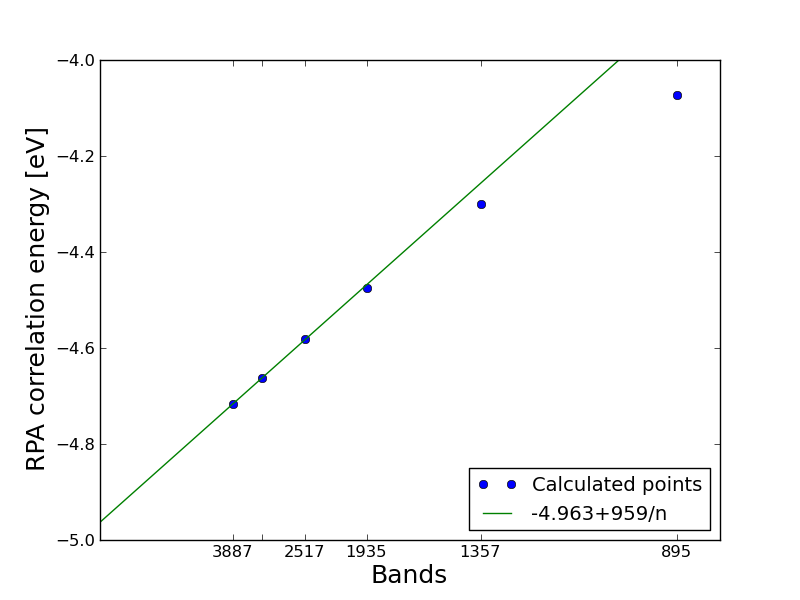

.. _rpa_tut:

==========================================================
Calculating RPA correlation energies
==========================================================

The Random Phase Approximation (RPA) can be used to derive a non-local expression for the ground state correlation energy. The calculation requires a large number of unoccupied bands and is significantly heavier than standard DFT calculation using semi-local exchange-correlation functionals. However, when combined with exact exchange the method has been shown to give a good description of van der Waals interactions as well as covalent bonds.

For more details on the theory and implemenation we refer to :ref:`rpa`. Below we give examples on how to calculate the RPA atomization energy of :math:`N_2` and the correlation energy of a Kr fcc lattice. Note that these tutorials will need a lot of CPU time and is essentially not possible without a supercomputer.

Example 1: Atomization energy of N2
===================================

The atomization energy of :mol:`N2` is overestimated by typical GGA functionals, and the RPA functional seems to do a bit better. This is not a general trend for small molecules, however, typically the HF-RPA approach yields to small atomization energies when evaluated at the GGA equilibrium geometry. See for example Furche \ [#Furche]_ for a table of atomization energies for small molecules calculated with the RPA functional. The main advantage is that RPA includes non-local correlation as well as giving a reasonable description of covalent bonds and the functional has no fitted parameters.

Ground state calculation
--------------------------

First we set up a ground state calculation with lots of unoccupied bands. This is done with the script::

    from ase import *
    from ase.units import Ha, Bohr
    from ase.parallel import paropen
    from gpaw import *
    from gpaw.xc.hybrid import HybridXC
    from gpaw.response.cell import get_primitive_cell, set_Gvectors

    d = 6.
    max_cut = 400.

    # N -------------------------------------------

    N = molecule('N')
    N.set_pbc(True)
    N.set_cell((d, d, d))
    N.center()
    calc = GPAW(h=0.18,
                maxiter=300,
                xc='PBE',
                hund=True,
                txt='N.txt',
                convergence={'density': 1.e-6})

    N.set_calculator(calc)
    N.set_calculator(calc)
    E1_pbe = N.get_potential_energy()
    E1_hf = E1_pbe + calc.get_xc_difference(HybridXC('EXX'))

    acell = N.cell / Bohr
    bcell = get_primitive_cell(acell)[1]
    gpts = calc.get_number_of_grid_points()
    max_bands = set_Gvectors(acell, bcell, gpts, [max_cut/Ha, max_cut/Ha,max_cut/Ha])[0]

    calc.set(nbands=max_bands+500,
             fixdensity=True,
             eigensolver='cg',
             convergence={'bands': -500})
    N.get_potential_energy()

    calc.write('N.gpw', mode='all')

    # N2 ------------------------------------------

    N2 = molecule('N2')
    N2.set_pbc(True)
    N2.set_cell((d, d, d))
    N2.center()
    calc = GPAW(h=0.18,
                maxiter=300,
                xc='PBE',
                txt='N2.txt',
                convergence={'density': 1.e-6})

    N2.set_calculator(calc)
    dyn = BFGS(N2)
    dyn.run(fmax=0.05)
    E2_pbe = N2.get_potential_energy()
    E2_hf = E2_pbe + calc.get_xc_difference(HybridXC('EXX'))
    f = paropen('PBE_HF.dat', 'w')
    print >> f, 'PBE: ', E2_pbe - 2*E1_pbe
    print >> f, 'HF: ', E2_hf - 2*E1_hf
    f.close()

    calc.set(nbands=max_bands+500,
             fixdensity=True,
             eigensolver='cg',
             convergence={'bands': -500})
    N2.get_potential_energy()

    calc.write('N2.gpw', mode='all')

which takes on the order of 1000 CPU hours. The function set_Gvectors() determines how many bands one should converge in order include everything below 400 eV. The script generates N.gpw and N2.gpw which are the input to the RPA calculation. The PBE and non-selfconsistent Hartree-Fock energy is also calculated and written to the file PBE_HF.dat.

Converging the frequency integration
-------------------------------------

We will start by making a single RPA calculation with extremely fine frequency sampling. The following script returns the integrand at 2001 frequency points from 0 to 1000 eV at a particular q-point and a low cutoff energy (since there is no k-point sampling, only q=[0,0,0] is possible here and one therefore needs to specify a direction as well)::

    from ase import *
    from ase.parallel import paropen
    from gpaw import *
    from gpaw.mpi import serial_comm
    from gpaw.xc.rpa_correlation_energy import RPACorrelation
    import numpy as np

    ws = np.array([0.5*i for i in range(2001)])
    ecut = 50

    calc = GPAW('../N2.gpw', communicator=serial_comm, txt=None)

    rpa = RPACorrelation(calc, txt='frequency_equidistant.txt')

    Es = rpa.get_E_q(ecut=ecut, w=ws, integrated=False,
                     q=[0,0,0], direction=0)

    f = paropen('frequency_equidistant.dat', 'w')
    for w, E in zip(ws, Es):
        print >> f, w, E.real
    f.close()

The correlation energy is obtained as the integral of this function divided by :math:`2\pi` and yields -6.20128806301. The frequency sampling is dense enough so that this value can be regarded as "exact". We can now test the Gauss-Legendre integration method with different number of points using the same script but now specifying the gauss_legendre parameters instead of a frequency list:: 

    Es = rpa.get_E_q(ecut=ecut, 
                     gauss_legendre=16,
                     frequency_cut=800, 
                     frequency_scale=2.0, 
                     integrated=False,
                     q=[0,0,0], direction=0)

This is the default parameters for Gauss-legendre integration. The gauss_legendre keyword specifies the number of points, the frequency_cut keyword sets the value of the highest frequency (but the integration is always an approximation for the infinite integral) and the frequency_scale keyword determines how dense the frequencies are sampled close to :math:`\omega=0`. The integrands for a few values of these parameters are shown below

.. image:: integration.png
	   :height: 400 px

and the value of the integral for a range of parameters is shown below (all values in eV)

========================  =========================  ===================   =================
Gauss-Legendre points     Frequency cutoff           Frequency scale       Integral
========================  =========================  ===================   =================
 16	          		200	 	        1.2		   -6.20096472755
 16	          		400	 	        1.0		   -6.20098397539
 16	          		800	 	        1.0		   -6.20142141865
 16	          		800	 	        1.5		   -6.20230759884
 16	          		800	 	        2.0		   -6.20128258259
 16	          		800	 	        2.5		   -6.20128752831
 8	          		800	 	        1.5		   -6.20320052778
 8	          		800	 	        2.0		   -6.19060172312
 8	          		800	 	        2.5		   -6.19746309627
========================  =========================  ===================   =================

======================== =
Exact
======================== =
-6.20128806301	          		
======================== = 

It is seen that using the default values gives a result which is extremely well converged. Below we will simply use the default values allthough we could perhaps use 8 points instead of 16, which would half the total CPU time for the calculations. In this particular case the result is not very sensitive to the frequency scale, but if the there is a non-vanishing density of states near the Fermi level, there may be much more structure in the integrand near :math:`\omega=0` and it is important to sample this region well.

Extrapolating to infinite number of bands
-----------------------------------------

To calculate the atomization energy we need to obtain the correlation energy as a function of number of bands and extrapolate to infinity as explained in :ref:`rpa`. This is accomplished with the script::

    from ase import *
    from ase.parallel import paropen
    from gpaw import *
    from gpaw.mpi import serial_comm
    from gpaw.xc.rpa_correlation_energy import RPACorrelation

    calc1 = GPAW('N.gpw', communicator=serial_comm, txt=None)
    calc2 = GPAW('N2.gpw', communicator=serial_comm, txt=None)

    rpa1 = RPACorrelation(calc1, txt='rpa_N.txt')    
    rpa2 = RPACorrelation(calc2, txt='rpa_N2.txt')

    for ecut in [100, 150, 200, 250, 300, 350, 400]:
        E1 = rpa1.get_rpa_correlation_energy(ecut=ecut,
                                             directions=[[0, 1.0]])
        E2 = rpa2.get_rpa_correlation_energy(ecut=ecut,
                                             directions=[[0, 2/3.], [2, 1/3.]])

        f = paropen('rpa.dat', 'a')
        print >> f, ecut, rpa1.nbands, E2 - 2*E1
        f.close()

which calculates the correlation part of the atomization energy with the bands and plane waved corresponding to the list of cutoff energies. Note that the default value of frequencies (16 Gauss-Legendre points) is used and the calculation parallelizes efficiently over the frequencies. The result is written to rpa.dat and can be visualized with the script::

    import numpy as np
    from pylab import *

    A = np.loadtxt('rpa.dat').transpose()
    plot(A[1]**(-1.), A[2], 'o', label='Calculated points')

    xs = np.array([A[1,0]+i*100000. for i in range(50000)])
    plot(xs**(-1.), -4.963+958.7*xs**(-1), label='-4.963+959/n')

    t = [int(A[1,i]) for i in range(len(A[0]))]
    t[-2] = ''
    xticks(A[1]**(-1.0), t, fontsize=12)
    axis([0.,None, None, -4.])
    xlabel('Bands', fontsize=18)
    ylabel('RPA correlation energy [eV]', fontsize=18)
    legend(loc='lower right')
    show()

The result is shown below

The fit is seen to be very good at the last three points and we find an extrapolated value of -4.96 eV for the correlation part of the atomization energy. The results are summarized below (all values in eV	)

======   =====   =====   ======       ============
PBE      HF      RPA     HF+RPA       Experimental
======   =====   =====   ======       ============
10.668	 4.821   4.963   9.774  	9.887
======   =====   =====   ======       ============

The RPA result seems to be much better than the PBE result. However, one should also be aware that due to the non-local nature of the RPA functional, very large supercells are needed to avoid spurious interactions between repeated images and the calculation done for the 6x6x6 cell used here is not expected to be fully converged with respect to super cell size. See ref. \ [#Harl]_ for more details on this.

Example 2: Correlation energy of bulk Kr
=============================================

As an example involving k-point sampling, we calculate the correlation energy of an fcc Krypton lattice with a unit cell volume of :math:`40\AA^3`

Ground state calculation
--------------------------

The following script performs a ground state calculation with the number of bands corresponding to 300 eV::

    from ase import *
    from ase.structure import bulk
    from ase.units import Ha, Bohr
    from gpaw import *
    from gpaw.response.cell import get_primitive_cell, set_Gvectors

    V = 40
    a0 = (4.*V)**(1/3.)
    Kr = bulk('Kr', 'fcc', a=a0)

    calc = GPAW(h=0.18, xc='PBE', kpts=(6, 6, 6), nbands=8,
                txt='Kr_gs.txt')
    Kr.set_calculator(calc)
    Kr.get_potential_energy()

    acell = Kr.cell / Bohr
    bcell = get_primitive_cell(acell)[1]
    gpts = calc.get_number_of_grid_points()
    ecut = 300    
    max_bands = set_Gvectors(acell, bcell, gpts, [ecut/Ha,ecut/Ha,ecut/Ha])[0]

    calc.set(nbands=max_bands+50, 
             eigensolver='cg', 
             fixdensity=True,
             convergence={'bands': -50})
    Kr.get_potential_energy()

    calc.write('Kr_gs.gpw', mode='all')

Note that for the large non-selfconsistent calculation, we use the conjugate gradient eigensolver, which is better suited for converging many unoccupied states. It also helps the eigensolver to include the 50 extra states, which are not converged.

Obtaining the RPA correlation energy
------------------------------------

In principle on should start by converging the frequency sampling as in Example 1. However, the integrand is extremly flat for a wide gap system as Kr and the default frequency sampling is expected to be good enough. In fact it is properly enough to use less frequency points than the default value of 16 points and one could most likely save some time by examining this, but below we just use the default value.

It is not possible to fully converge the RPA correlation energy with respect to the energy and number of unoccupied bands, but as in Example 1, the results of a few calculations are easily extrapolated to the value corresponding to infinite cutoff. The following script calculates the RPA correlation energy for a few cutoff energies (the number of bands in the calculation is equal to the number of plane waves defined by the cutoff)::

    from ase import *
    from ase.parallel import paropen
    from gpaw import *
    from gpaw.mpi import serial_comm
    from gpaw.xc.rpa_correlation_energy import RPACorrelation
    import numpy as np

    calc = GPAW('Kr_gs.gpw', communicator=serial_comm, txt=None)
    rpa = RPACorrelation(calc, txt='extrapolate.txt')

    for ecut in [150, 175, 200, 225, 250, 275, 300]:
        E_rpa = rpa.get_rpa_correlation_energy(ecut=ecut, 
                                               kcommsize=8, 
                                               directions=[[0, 1.]])

        f = paropen('extrapolate.dat', 'a')
        print >> f, ecut, rpa.nbands, E_rpa
        f.close()

The kcommsize=8 keyword tells the calculator to use 8 k-point domains and the calculation is thus fully parallelized over k-points. If the number of cpus is larger than kcommsize, parallelization over freqency points will be initiated, which is much less efficient than k-point parallelization. However, the memory consumption may sometimes be exceedingly high since the full response function is stored in all frequency points and parallelizing over frequencies may then be useful. When choosing a parallelization scheme, it should be noted that the response function involves a sum over all k-points and not just those in the irreducible part of reciprocal space. The total number of cpus should be equal to the number of frequency domains (divisible in frequency points) times the number of k-point domains (specified by kcommsize). The directions keyword tells the calculator to only consider the x direction when doing the optical limit for q=[0,0,0].

The result can be plotted with the script:: 

    import numpy as np
    from pylab import *

    A = np.loadtxt('extrapolate.dat').transpose()
    xs = np.array([170 +i*100. for i in range(500)])

    plot(A[1]**(-1.), A[2], 'o', markersize=8, label='Calculated points')
    plot(xs**(-1), -10.08+281.705/xs, label='Fit: -10.08+282/bands')
    t = [int(A[1,i]) for i in range(len(A[1]))]
    t[3] = ''
    xticks(A[1]**(-1.), t)
    xlabel('bands', fontsize=16)
    ylabel('Correlation energy', fontsize=16)
    axis([0.,None,None,None])
    title('RPA correlation energy of fcc Kr lattice at $V=40\,\AA^3$')
    legend(loc='upper left')
    show()

and is shown below. The calculated points are very well fitted by the function: :math:`E_c(n)=E_c^{RPA}+A/n` where :math:`n` is the number of bands (defined by the cutoff values) and we can read off an RPA correlation energy of -10.08 eV. 

.. image:: extrapolate_Kr.png
	   :height: 400 px

One can proceed like this for a range of different unit cell volumes and obtain the figure below. Here the correlation energy of an isolated Kr atom (the value extrapolated to infinite volume) has been subtracted from the plotted values. One sees a clear :math:`V^{-2}` dependence, which is characteristic of van der Waals bonded systems.

.. image:: volume.png
	   :height: 400 px

In order to obtain the total energy, the correlation energy should be added to the Hartree-fock energy, which can be obtained (non-selfconsistently) by::
    
    from ase.parallel import paropen
    from gpaw import *
    from gpaw.xc.hybridk import HybridXC

    calc = GPAW('Kr_gs.gpw', txt=None)
    E = calc.get_potential_energy()
    exx = HybridXC('EXX')
    E_hf = E + calc.get_xc_difference(exx)
	
    f = paropen('hf_energy.dat', 'a')
    print >> f, E_hf
    f.close()
  

.. [#Furche] F. Furche,
             *Phys. Rev. B* **64**, 195120 (2001)

.. [#Harl] J. Harl and G. Kresse,
           *Phys. Rev. B* **77**, 045136 (2008)
