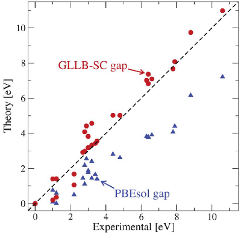

.. _band_gap:

=================================================
Calculating band gap using the GLLB-sc functional
=================================================

In this tutorial, we calculate the band gaps of semiconductors by using
the GLLB-sc functional. [#Kuisma2010]_ The calculation involves correcting
the Kohn-Sham band gap with the discontinuity obtained from the response
potential.
This approach has been shown to improve the band gap description as shown
in the figure below taken from [#Castelli2012]_.

A band gap calculation starts with a usual ground state calculation
(here for silicon):

.. literalinclude:: gllbsc_si_simple.py
   :start-after: P1
   :end-before: P2

Then we calculate the discontinuity potential, the discontinuity,
and the band gap with the following steps:

.. literalinclude:: gllbsc_si_simple.py
   :start-after: P2

.. warning::
   **Note that the band edges (HOMO/VBM and LUMO/CBM) are needed as inputs
   for the discontinuity potential!
   To get accurate results, both VBM and CBM should be included in the used
   k-point sampling.** See the next example.

This calculation gives for silicon the band gap of 1.05 eV
(compare to the experimental value of 1.17 eV [#Kuisma2010]_).

The accurate values of HOMO/VBM and LUMO/CBM are important for the calculation,
and one strategy for evaluating them accurately is to use
:ref:`a band structure calculator <bandstructures>` that has VBM and CBM at
the bandpath:

.. literalinclude:: gllbsc_si_band_edges.py
   :start-after: P1
   :end-before: P2

Then we evaluate band edges using :code:`bs_calc`, the discontinuity potential
using :code:`calc`, and the discontinuity using :code:`bs_calc`
(including at least VBM and CBM):

.. literalinclude:: gllbsc_si_band_edges.py
   :start-after: P2

.. warning::
   **Note that also when using the band structure calculator,
   one needs to make sure that both VBM and CBM exists at the bandpath!**

Also this calculation gives for silicon the band gap of 1.05 eV
(compare to the experimental value of 1.17 eV [#Kuisma2010]_).

.. note::
   The first, simple approach would give very different results if
   :code:`kpts=(7, 7, 7)` would be changed to
   :code:`kpts={'size': (8, 8, 8), 'gamma': True}` (try it out!).
   When using the second approach with a suitable band structure calculator
   for obtaining VBM and CBM, issues with different k-point samplings
   can often be avoided.

The full scripts: :download:`gllbsc_si_simple.py` and
:download:`gllbsc_si_band_edges.py`.

Spin-polarized GLLB-SC
======================

Spin-polarized GLLB-SC is currently implemented to svn trunk. However there
are some convergence issues releated to fermi smearing and the reference
energy of highest orbital. Also some parts are still untested. The code will
be improved to robust version soon, but in the meantime please contact
mikael.kuisma@tut.fi before using.

References
==========

.. [#Kuisma2010] M. Kuisma, J. Ojanen, J. Enkovaara, and T. T. Rantala,
   *Kohn-Sham potential with discontinuity for band gap materials*,
   Phys. Rev. B **82**, 115106 (2010),
   :doi:`10.1103/PhysRevB.82.115106`

.. [#Castelli2012] Ivano E. Castelli, Thomas Olsen, Soumendu Datta,
   David D. Landis, Søren Dahl, Kristian S. Thygesen, and Karsten W. Jacobsen,
   *Computational screening of perovskite metal oxides for optimal solar light
   capture*, Energy Environ. Sci. **5**, 5814 (2012),
   :doi:`10.1039/c1ee02717d`
