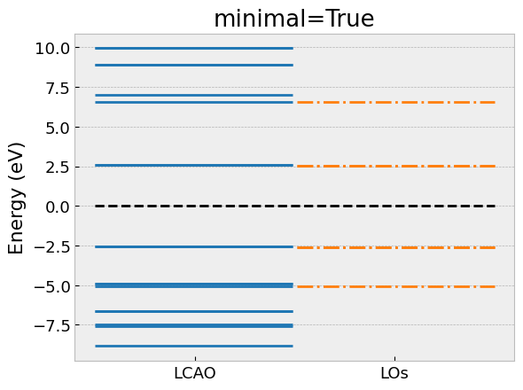
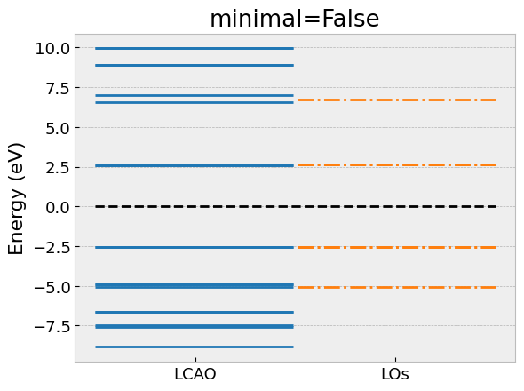
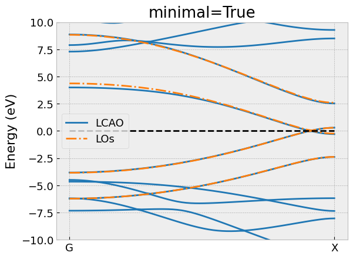

.. _los_tutorial:

==============
Local Orbitals      
==============

In this section we will describe how to obtain the Local Orbitals (LOs). 
The details of the theory are described in Ref. [#LOS]_. The starting
point is a DFT calculation in LCAO mode:: 

  from gpaw.local_orbitals import LocalOrbitals
  calc = GPAW(mode='lcao', ...)
  los = LocalOrbitals(calc)

The local orbitals are obtained from a subdiagonalization of the LCAO Hamiltonian. 
A subdiagonalization is essentially a rotation that brings the 
Hamiltonian in a form where some blocks are diagonal matrices. 
Each block should include all Atomic Orbitals of a given atom. 
This tranformation can be performed with the ``subdiagonalization`` method::

  los.subdiagonalize(symbols: Array1D = None, blocks: list[list] = None, groupby: str = 'energy')

The blocks can be specified with one of the two keyword arguments:

``symbols``: Element or elements to subdiagonalize, optional.
  Automatically constructs the blocks for the specified element or elements.

``blocks``: Blocks to subdiagonalize, optional. 
  Directly provides the blocks in the form of a list of orbital indices, e.g. [[3,4,5],[6,7..]..].

Once the Hamiltonian is subdiagonalized, the method tries to group the obtained
LOs by symmetry:

``groupby``: Grouping criteria.
  - *energy* : Groups the LOs by energy
  - *symmetry* : Groups the LOs by spatial symmetry and energy

It is possible to fine-tune the grouping after a subdiagonalization with the 
following method::

  los.groupby(method: str = 'energy', decimals: int = 1, cutoff: float = 0.9),

``decimals``: Round energies to the given number of decimals
  Groups the LOs with an energy equivalent up to the given number of decimals.

``cutoff``: Cutoff spatial overlap, (0,1]
  Groups the LOs with a spatial overlap larger than the given cutoff value.

Next, we construct a low-energy model from a subset of LOs and/or AOs::

  los.take_model(indices: Array1D = None, minimal: bool = True, cutoff: float = 1e-3, ortho: bool = False)

``indices``: Orbitals to include in the low-energy model, optional
  Explicitely lists the orbital indices in the subdiagonalized Hamiltonian. 
  When left unspecified, the method will automacally select the orbitals in 
  each ``block`` with the energy closest to the Fermi level. We call this 
  ``minimal`` model. 

``minimal``: Limit the selection to the given ``indices``
  - *True* : Default value.
  - *False* : Extend the minimal model with the groups of LOs connecting to the minimal model with at least one matrix element in the Hamiltonian larger than ``cutoff``.

``otho``: Orthogonalize the low-energy model
  Orthogonalizes the orbitals in the low-energy model. We advise to use 
  this flag only for minimal models.

.. [#LOS]   G. Gandus, A. Valli, D. Passerone, and R. Stadler,  
            "Smart local orbitals for efficient calculations within density functional theory and beyond." 
            The Journal of Chemical Physics **153**, 194103 (2020)

Local Orbitals in benzene molecule
==================================

As a first example we generate the local orbitals (LOs) of an 
isolated benzene molecule :download:`C6H6.py`. 

.. literalinclude:: C6H6.py
    :start-after: Atoms

Here, we have omitted the ``import`` statements and the declaration of 
the ``compare_eigvals`` helper function to visually compare the 
eigenvalues of the low-energy model with the full LCAO calculation as horizontal lines. 

Local Orbitals in graphene nanoribbon
=====================================

As a second example we generate the local orbitals (LOs) of a 
graphene nanoribbon :download:`C4H2.py`. 

.. literalinclude:: C4H2.py
    :start-after: Atoms

Again, we have omitted the ``import`` statements and the declaration of 
the ``compare_bandstructure`` helper function to compare the 
bands of the low-energy model with the full LCAO calculation. 

.. image:: C4H2_extended.png
    :alt: extended
    :width: 500
